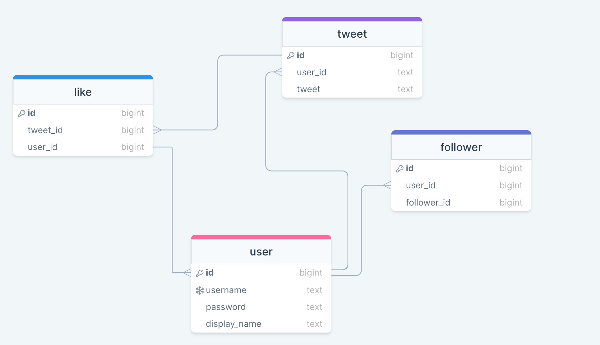

# Twitter clone API 🐦

A tiny app implementing twitter core feature

#### Tech Stack

- [TypeScript](https://www.typescriptlang.org/)
- [NodesJS](https://nodejs.org/)
- [ExpressJS](https://expressjs.com/)
- [PostgreSQL](https://www.postgresql.org/) hosted on ([ElephantSQL](https://www.elephantsql.com/))

#### Database Structure / Relationships 💾

(https://drawsql.app/teams/team-ize/diagrams/twitter-clone-db)

#### How to run 🏃

- Clone the repo
- Run `npm install` to install dependencies
- Create a .env file with content from [env.example](env.example)
- Run `npm run start:dev` to run in development mode
- This usually runs on port 3000 unless otherwise stated

#### Todos

- Refresh token implementation
- Timeline feed
- Fetch user's tweets, replies, liked tweets
- Retweet feature

### API Documentation

[API Documentation on Postman](https://documenter.getpostman.com/view/7097316/2s9XxyPsdx#cec8e4d7-9722-45f5-9da0-374a8c165fe0)
